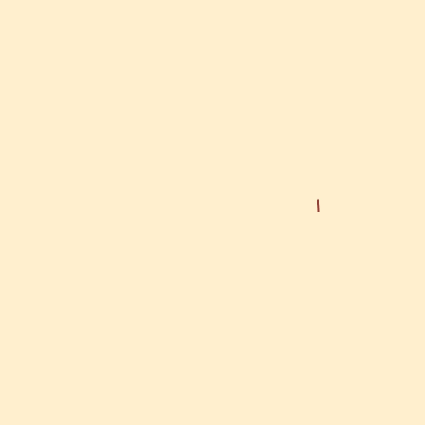

# Examples

## Fundamentals

[tween.lua](tween.lua): Shows the basics of working and animating variables

[curve.lua](curve.lua): Demonstrates how to plot curves

## Geometry

[circle-intersection.lua](circle-intersection.lua): Shows the intersection points of two circles.

[circle-three-points.lua](circle-three-points.lua): Constructs a circle given three points.

